# IBM Bob Lab — Java Modernization Lab Guide


# Lab 1: Bob Fundamentals

**Duration:** 45 minutes  
**Objective:** Learn to use Bob as an AI-powered Java Modernization Expert.

## Learning Objectives

By completing this lab, you will be able to:
- Connect MCP servers to Bob IDE
- Create and Understand Bob custom modes
- See Bob understand and build off of a natural language userstory
- Make code modifications with AI assistance
- Create comprehensive documentation automatically

## Prerequisites

- IBM Bob IDE
  - Ensure you have IBM Bob latest version installed
  - Login through Bob to get connected

- Atlassian account with Jira project access
  - The instructor should set up a free atlassian jira account here - https://www.atlassian.com/software/jira
  - Use your gmail id or any other id since IBM id will require adding you to IBM account and it would be difficult to add the bootcamp participants to it.
  - Continue to create your org space with atlassian.net domain and note it - eg: https://ce-squad-7.atlassian.net/
  - Create a new space in your jira dashboard. Click on the '+' sign next to the "Spaces" option on the left navigation options.

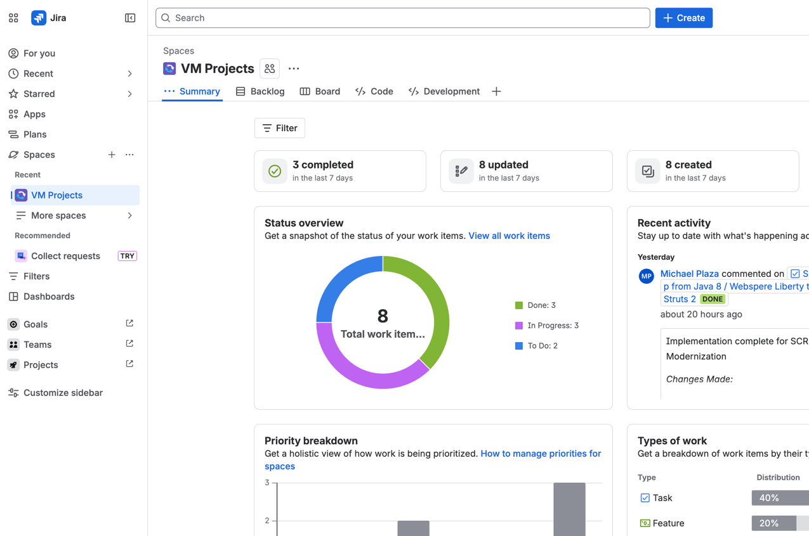
  - Start with a Scrum or a Kanban board. Click on Scrum option and click on use template.

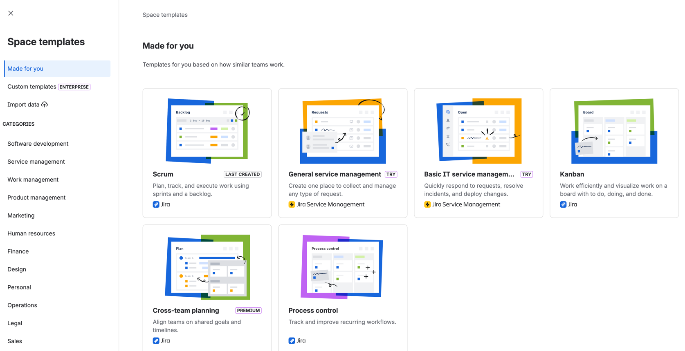

  - Add your board name, for space managed chose team managed option, for access choose limited and add the Key. This key is important since this acts as the tag for all stories you create in the board and how Bob would access the stories. For us the key is "SCRUM"

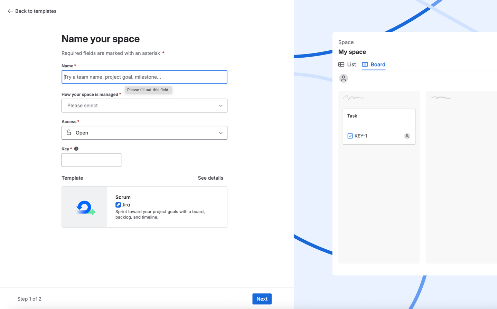

  - On the next page you should be able to add all the members to the board
  - Now you can start creating user stories on the board. Note the url of the board. You will need to add this to the custom mode docs to ensure the Smart SDLC mode accesses the correct user stories for all users. You only need To Do, In Progress and Done for this lab.

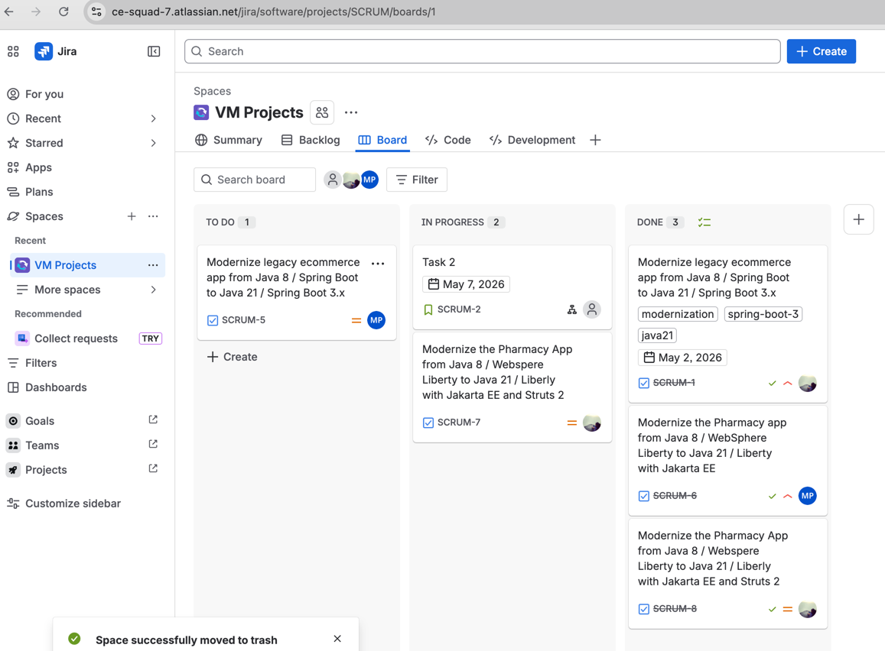

- Custom mode updates (this can also be done by the participants)
  - Modify the custom mode lab with the jira board information. This can also be done via the env file and by prompting bob to use the jira board details from the env file. But for this lab we would be hard coding the board details in the rules of the custom mode.
  - In the .bob/rules-smart-sdlc/1_workflow.xml file, search for the **Fetch Jira User Story** block. For the mcp configuration section add the following details:
    ```bash
    <mcp_configuration>
        Project: <Your project or space name - Eg.: VM Projects> (< link to your scrum or kanban board eg: https://ce-squad-7.atlassian.net/jira/software/projects/SCRUM/boards/1>)
        Base URL: <Your atlassian.net url eg - https://ce-squad-7.atlassian.net/>
        Email: <instructor or participant email id>
      </mcp_configuration>
    ```
---
# For Bootcamp Participants:

## Step 1: Set up your Atlassian account and API
Accept the invite from the instructor ro join a jira space, after which the instructor will be able to add you to the Jira Board.
Generate your Atlassian Jira api token from here - https://id.atlassian.com/manage-profile/security/api-tokens
- Click on Create API Token. (not the scope ones)
- 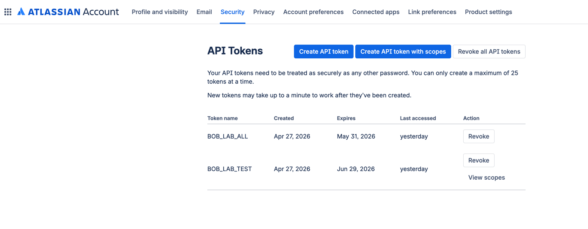
- Give a name and set an expiry for the token and click on Create
- 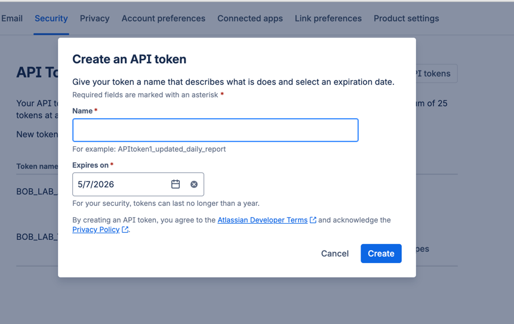
- Copy and save the api token. You will need to add this to the MCP server connection later.
- 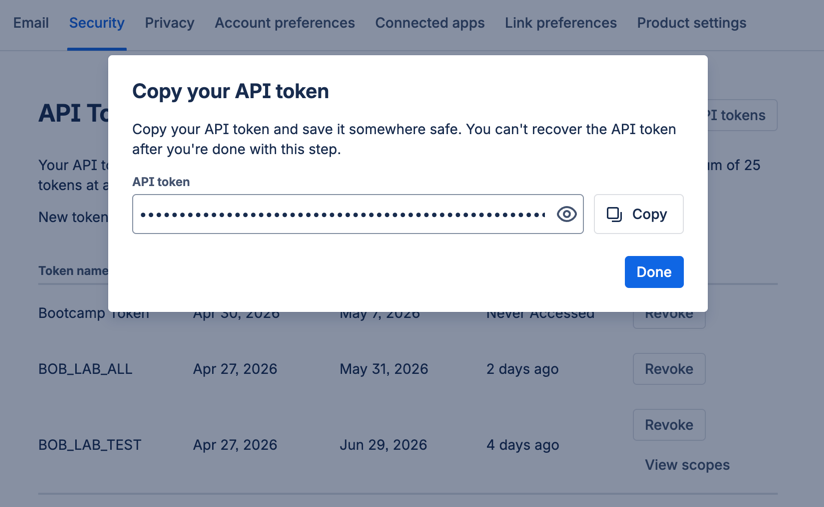

## Step 2: Set up the MCP Server

**MCP Server (need to be set up in bob global mcp setting)**:
- **Atlassian Jira MCP** — Bob fetches user stories and posts completion comments
  - Note: This mcp server has a lot of functions and can cause context bloat. The mcp block mentions important functions needed. If tokens and bob coins is a concern, turn off function not needed for the lab in the global mcp settings.
  - Open your Bob IDE and navigate to 'Bob - Settings' option at the bottom of the IDE and click on it.
  - 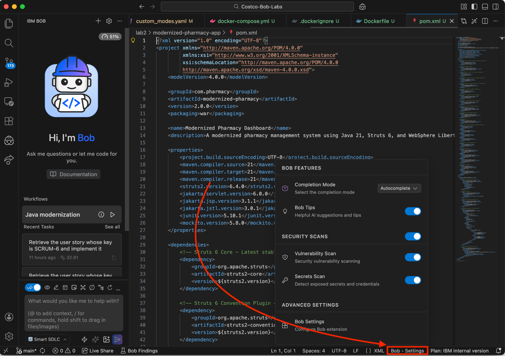
  - Click on MCP and open the global mcp setting
  - 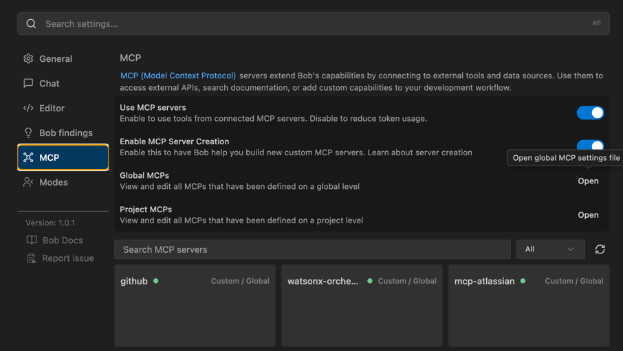
  - Copy the following MCP server connection details as a new mcp in the json file that opens: (you can remove the disabled tools section, we only added it to restrict scope of the mcp server)
  ```bash
          "mcp-atlassian": {
            "command": "uvx",
            "args": [
                "mcp-atlassian"
            ],
            "env": {
                "JIRA_URL": "<your atlassian.net url> eg: https://ce-squad-7.atlassian.net",
                "JIRA_USERNAME": "<your email id>",
                "JIRA_API_TOKEN": "<your atlassian token>",
                "CONFLUENCE_URL": "",
                "CONFLUENCE_USERNAME": "",
                "CONFLUENCE_API_TOKEN": ""
            },
            "timeout": 300,
            "alwaysAllow": [
                "jira_get_board_issues",
                "jira_get_issue",
                "jira_add_comment",
                "jira_transition_issue",
                "jira_get_transitions"
            ],
            "disabledTools": [
                "jira_get_issue_watchers",
                "jira_add_watcher",
                "jira_remove_watcher",
                "jira_search",
                "jira_search_fields",
                "jira_get_field_options",
                "jira_get_project_issues",
                "jira_get_worklog",
                "jira_download_attachments",
                "jira_get_issue_images",
                "jira_get_agile_boards",
                "jira_get_sprints_from_board",
                "jira_get_sprint_issues",
                "jira_get_link_types",
                "jira_create_issue",
                "jira_batch_create_issues",
                "jira_batch_get_changelogs",
                "jira_delete_issue",
                "jira_edit_comment",
                "jira_add_worklog",
                "jira_link_to_epic",
                "jira_create_issue_link",
                "jira_create_remote_issue_link",
                "jira_remove_issue_link",
                "jira_create_sprint",
                "jira_update_sprint",
                "jira_add_issues_to_sprint",
                "jira_get_project_components",
                "jira_get_all_projects",
                "jira_get_project_versions",
                "jira_get_service_desk_for_project",
                "jira_get_service_desk_queues",
                "jira_get_queue_issues",
                "jira_create_version",
                "jira_batch_create_versions",
                "jira_get_issue_proforma_forms",
                "jira_get_proforma_form_details",
                "jira_update_proforma_form_answers",
                "jira_get_issue_dates",
                "jira_get_issue_sla",
                "jira_get_issue_development_info",
                "jira_get_issues_development_info"
            ]
        }
  ```
    -  Once added refresh all icon next to the 'All' dropdown to refresh the servers on the Bob - Settings MCP main page (where you clicked on Open for the json) just to ensure bob connects successfully. You can ignore this step if you already see the server in your mcp list with a green dot.
    - 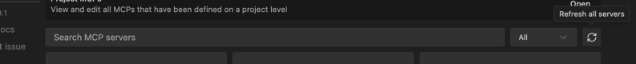


## Step 3: Setup Java
### 3.1 SDKMAN! (SDK Manager)
SDKMAN! is a tool for managing parallel versions of multiple Software Development Kits on Unix-based systems.

**Installation Instructions:**
```bash
curl -s "https://get.sdkman.io" | bash
source "$HOME/.sdkman/bin/sdkman-init.sh"
```

**Verify Installation:**
```bash
sdk version
```

You should see output like: `SDKMAN! 5.x.x`

**For detailed instructions, visit:** https://sdkman.io/install/

### 3.2 Maven (via SDKMAN!)
After installing SDKMAN!, install Maven:

```bash
sdk install maven
```

**Verify Maven Installation:**
```bash
mvn --version
```

**Alternative: Install Java 21 without SDKMAN**

If you prefer not to upgrade Bash, install Java 21 directly:

```bash
# macOS with Homebrew
brew install openjdk@21

# Add to PATH
echo 'export PATH="/opt/homebrew/opt/openjdk@21/bin:$PATH"' >> ~/.zshrc
source ~/.zshrc

# Verify
java -version
```

### Check Maven

```bash
mvn -version
```

**Expected output:** Maven 3.x

**If not installed:**
```bash
# Install Maven via SDKMAN
sdk install maven

# Verify
mvn -version
```
You should see Maven version information along with the Java version that Maven is using.


### For OpenShift VM:
You might have to install curl before doing any of the steps. Here are the detailed steps to ensure you have Java setup properly on your VM.

Install the required packages before installing SDKMAN!:

```bash
sudo dnf update -y
sudo dnf install -y zip unzip curl which
```

SDKMAN! installation on Linux systems may require tools such as `zip`, `unzip`, and `curl`.

```bash
curl -s "https://get.sdkman.io" | bash
source "$HOME/.sdkman/bin/sdkman-init.sh"
```

### Verify Installation

```bash
sdk version
```

You should see output similar to:

```text
SDKMAN! 5.x.x
```

### Persist SDKMAN in Your Shell

To make SDKMAN! available in future terminal sessions, add it to your shell profile:

```bash
echo 'source "$HOME/.sdkman/bin/sdkman-init.sh"' >> ~/.bash_profile
source ~/.bash_profile
```

For detailed instructions, visit: [https://sdkman.io/install/](https://sdkman.io/install/)

After installing SDKMAN!, install Maven:

```bash
sdk install maven
```

### Verify Maven Installation

```bash
mvn --version
```

### Alternative to SDKMAN
If you prefer not to use SDKMAN!, install Java 21 directly with the native RHEL package manager:

```bash
sudo dnf install -y java-21-openjdk-devel
```

### Set `JAVA_HOME`

Add Java 21 to your shell profile:

```bash
echo 'export JAVA_HOME=/usr/lib/jvm/java-21-openjdk' >> ~/.bash_profile
source ~/.bash_profile
```

### Install Maven Natively

```bash
sudo dnf install -y maven
```

### Verify Java and Maven

```bash
java -version
mvn -version
```

Expected output:

```text
Maven 3.x
```

Red Hat provides OpenJDK 21 packages for RHEL, and Maven can also be installed through the system package manager.

```bash
mvn -version
```

You should see Maven version information along with the Java version that Maven is using.


### **Important Note on Java Versions:**
When you run `mvn --version`, it shows the Java version that Maven will use to build your project. This may differ from your system's default Java version (shown by `java -version`). Maven uses the Java version specified by the `JAVA_HOME` environment variable or the Java installation that SDKMAN! has configured.

### Important: Restart Bob After Maven Installation

**⚠️ CRITICAL STEP:** After installing Maven via SDKMAN!, you **MUST** close and restart IBM Bob (or your IDE) for the changes to take effect. This ensures Bob can detect and use the newly installed Maven.

**To restart Bob:**
1. Close your IDE completely
2. Reopen your IDE
3. Verify Maven is detected by running the command to verify its installation in Bob's terminal


## Step 4: Set Up Jira User Stories
Every participant needs a Jira User Story to work with. Here is the story that needs to be added to the board in the TO-DO list. This is a basic modernization request, feel free to add more details or functionality request to this if you want to experiment more.:

To add a Jira Ticket/Task go to the following board - https://ce-squad-7.atlassian.net/jira/software/projects/SCRUM/boards/1

Click on '+Create' on either the top of the board or on the bottom of the "TO-DO" list

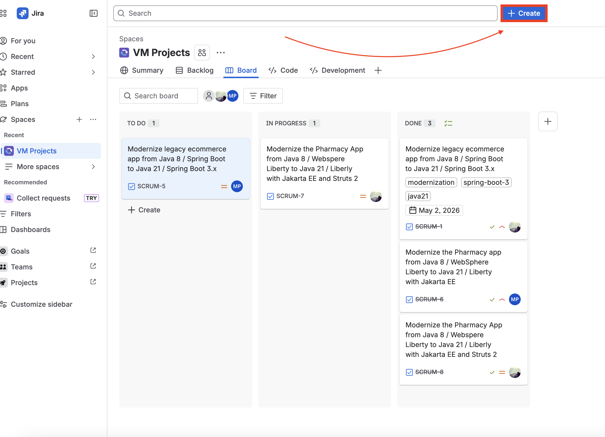

Start by adding the following `Summary` and `Description` to the ticket and press `Create`.

`Summary`:
```
Modernize the Pharmacy App from Java 8 / WebSphere Liberty to Java 21 / Liberty with Jakarta EE 8 and Struts 2
```

`Description`:
```text
User story

Modernize the Pharmacy application in lab2/snapB-java-upgrade to run on Java 21 and a compatible Liberty runtime with Jakarta EE 8 with the minimum code and configuration changes required to preserve existing behavior and get the application compiling, testing, packaging, and starting successfully.

Context

The goal of this story is platform compatibility first, not code redesign. The application is a Struts 2 web application with models, repositories, actions, JSP views, and Liberty configuration. This story should avoid broad refactoring and should preserve existing class shapes, method contracts, repository behavior, and action/view behavior unless a change is strictly required for Java 21 or Jakarta EE 8 compatibility.

Acceptance criteria

1. Runtime and dependency modernization

Update pom.xml to compile with Java 21.

Upgrade only the dependencies required for Java 21 and Liberty compatibility.

Migrate javax.* to jakarta.* for Jakarta EE 8 compatibility only where required by the selected runtime and libraries.

Update web.xml and Liberty configuration only as needed for compatibility.

Verify Struts, Liberty, ASM, Javassist, and test dependencies are compatible with the chosen stack.

2. Minimal-change implementation rules

Do not convert models, actions, or request-bound classes to records in this story.

Do not change enum values, enum descriptions, parser semantics, or helper-method semantics in this story.

Do not change repository seeding, filtering logic, or null-handling behavior unless required to restore legacy compatibility.

Do not replace BigDecimal logic with double or primitive arithmetic.

Preserve existing getters, setters, constructors, and public method signatures unless a compatibility fix requires otherwise.

3. Required validation only
The story is complete when the following pass:

    mvn clean test

    mvn clean package

    mvn liberty:run or ./run-liberty.sh

    browser verification of dashboard, medicine list, prescription list, and order list pages

4. Required targeted test suite
Create or maintain only the following targeted tests in this story:

Compile-safety checks for enums and public model APIs used by actions and repositories

One test verifying OrderStatus / PrescriptionStatus / PaymentMethod symbols and parsing methods still exist if present in the legacy app

One test verifying money calculations still use BigDecimal-compatible behavior

One MedicineRepository smoke test for findAll()

One MedicineRepository smoke test for updateStock()

One Medicine helper-method smoke test

One OrderRepository smoke test

One PrescriptionRepository smoke test

One action or integration smoke test per key page: dashboard, medicines, prescriptions, orders

5. Quality requirements

All required tests must pass on Java 21.

JaCoCo report must be generated.

Coverage target for this story is 30% minimum, focused on risky modernization paths rather than broad business-rule regression coverage.

Zero Blocker or Critical issues.

Zero newly introduced security vulnerabilities.

6. Reporting

Move the story to In Progress before starting.

Add comments summarizing:

    - dependency/runtime changes

    - whether ports changed

    - build result

    - test result

    - page verification result for dashboard, medicines, prescriptions, and orders

    - total time taken

Move the story to Done only after all required checks pass.
```

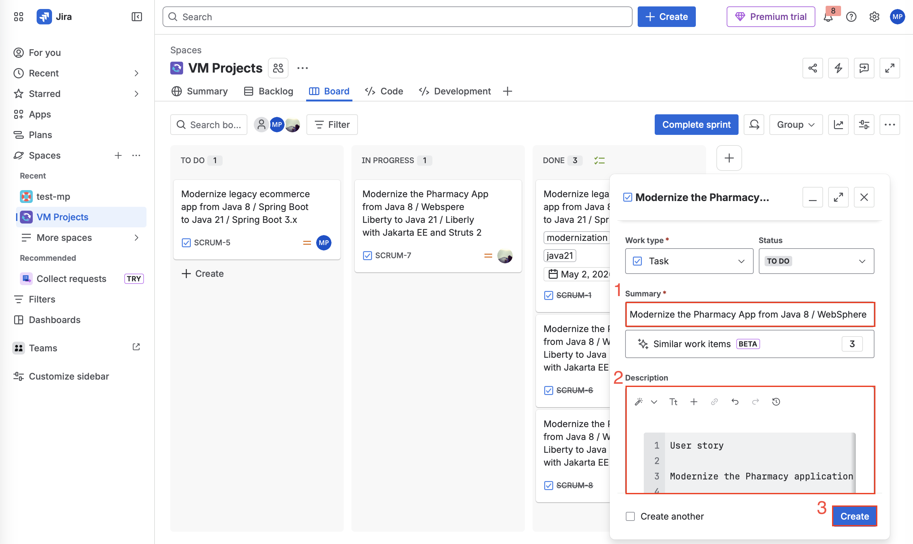


Once you click `Create`, there should be a pop up for the task/ticket. When the pop up shows up, click on the task/ticket name.

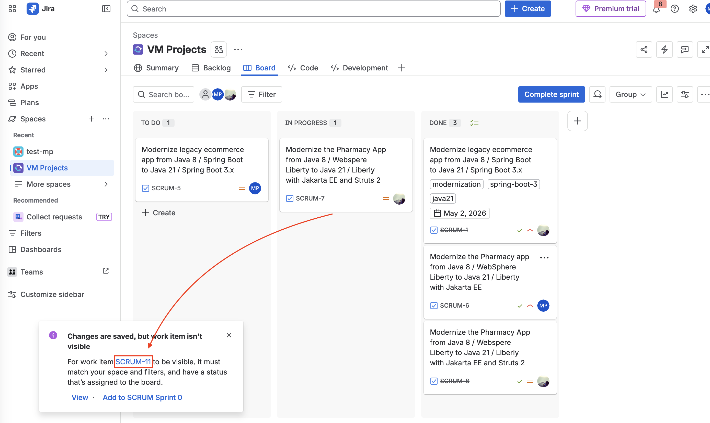

Then assign the task/ticket to yourself and close out of the task/ticket screen. 

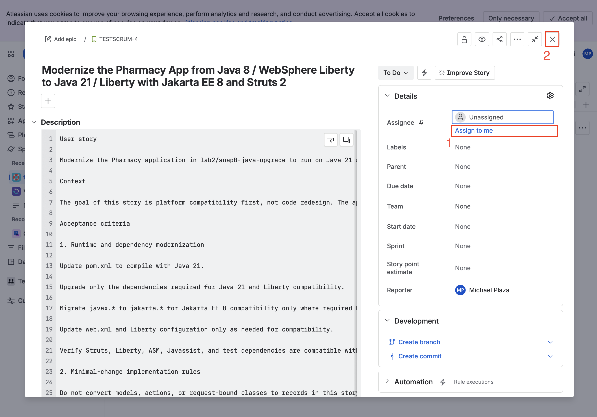

Now we have to create a sprint and assign the task/ticket to the sprint.

First, create a sprint by navigating to `Backlog` and clicking on `Create sprint`:

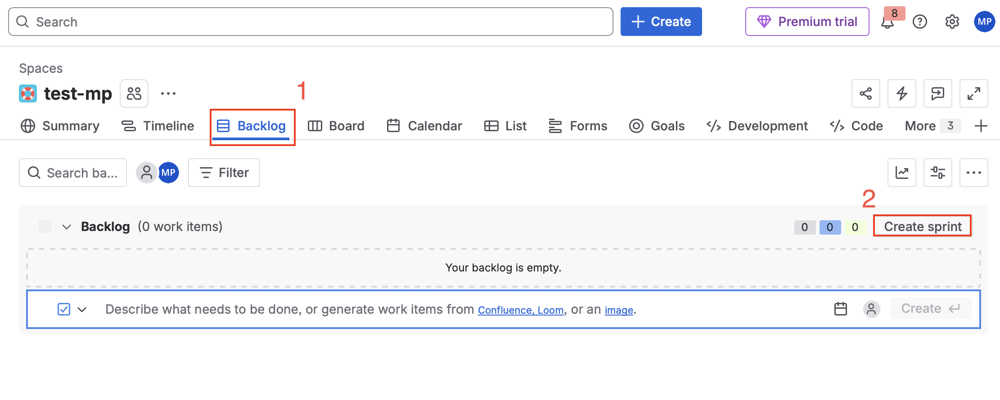

Now, drag the ticket into the sprint you just created and start the sprint.

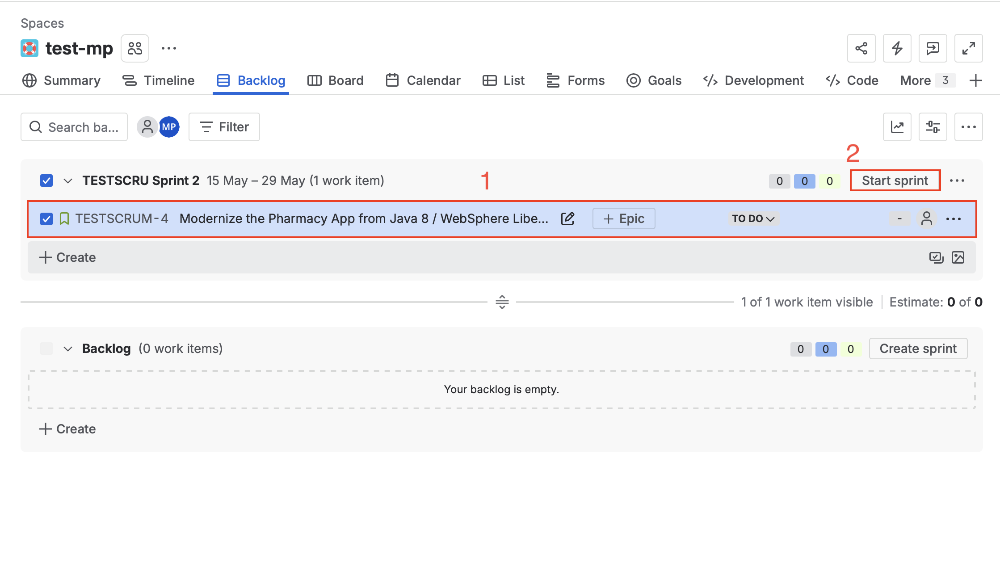

Click through the next window to start the sprint.

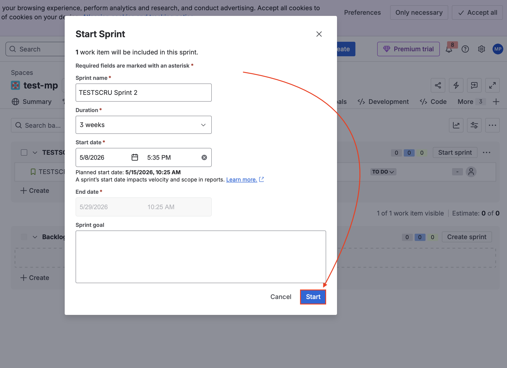

Now you should see the ticket on your `Board` page. If you do, you have successfully completed the Jira setup process and can proceed.

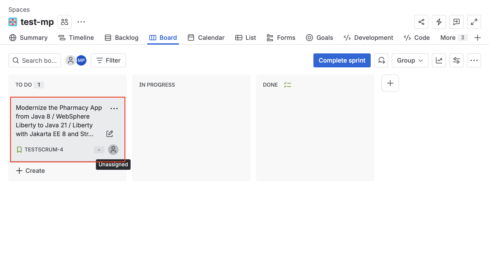


##### Important:
> Ensure the participant is marked as the assignee to the user story
> The participant needs to note the exact Jira key (e.g. `SCRUM-7`) when running Bob.
> 
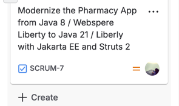

## Step 5: Custom Mode and MCP Check:
- In the project folder, you should see a .bob folder.
- In the .bob/rules-smart-sdlc/1_workflow.xml file, search for the **Fetch Jira User Story** block. For the mcp configuration section add or verify the following details (depending on what you instructor has mentioned):
```bash
    <mcp_configuration>
          Project: Your project or space name - Eg.: VM Projects (link to your scrum or kanban board eg: https://ce-squad-7.atlassian.net/jira/software/projects/SCRUM/boards/1)
          Base URL: Your atlassian.net url eg - https://ce-squad-7.atlassian.net/
          Email: instructor or participant email id
    </mcp_configuration>
```
- Save the file and open the bob chat interface.
- At the bottom of the Bob chat pane, you'll see the current mode (e.g., "💻 Code" or "❓ Ask"). Click on the current mode name at the bottom of the chat.
- You should see a "Smart SDLC" option now in the Bob Modes dropdown.
- 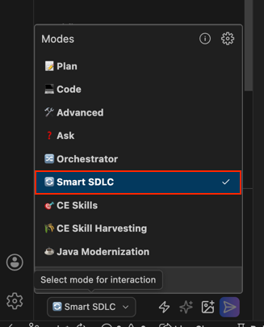
- For ease of doing the lab you can also set all auto approvals on
  - 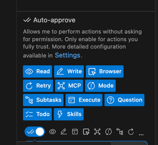
    - ## Auto-Approval Settings
      Here are some of the setting how can control what Bob does automatically:
          - **Read**: Let Bob read files without asking
          - **Write**: Let Bob modify files without asking
          - **Execute**: Let Bob run commands without asking
          - **Todo**: Let Bob create task lists without asking
          - **MCP**: Let's Bob access and connect to MCP servers automatically without asking.
- You can also check the custom mode details on the Bob Settings page by navigating to the Modes tab
- 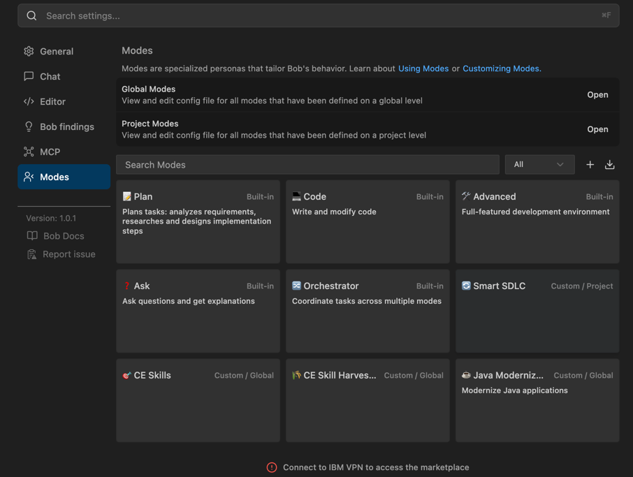
- Now that you have your mode and mcp setup. Let's confirm if Bob can actually connect to the Jira Board. Switch to Advanced or Code mode and ask the following:
```text
Do I have an jira board with a user story assigned to me?
```
- Bob should be able to connect to the board via the mcp, verify your email id based on the connection you have set up and fetch you the correct information.
- Once this works you are all set to work on your tickets.


## Step 6: Let's Ask Bob to Do All Our Work Now!

### Understand the need:
#### What is This Application?

The **Simple Pharmacy Management System** is a web-based application designed to manage pharmacy operations including:
- **Prescriptions**: Create and validate patient prescriptions
- **Orders**: Process medication orders and payments
- **Medicines**: Manage medicine inventory
- **Dashboard**: Monitor pending prescriptions and orders

#### What is Java Modernization?

Java Modernization is the process of upgrading legacy Java applications to modern versions and platforms. This typically involves:
- **Java Version Upgrade**: Moving from older Java versions (like Java 8) to newer LTS versions (like Java 21)
- **Application Server Migration**: Transitioning from traditional servers (like WebSphere) to lightweight runtimes (like Liberty)
- **Dependency Updates**: Modernizing libraries and frameworks to current, supported versions
- **Code Transformation**: Updating code patterns to leverage modern Java features

#### About This Lab

In this lab, you'll use IBM Bob's **Java Modernization mode** to modernize a legacy pharmacy management application. The application currently runs on:
- **Java Version**: 8
You'll modernize it to:
- **Java Version**: 21


---
### Main Workflow: See how the defined custom mode interacts with Jira MCP server and rules we have defined to perform Java modernization
- Open Bob chat and chose the 'Smart SDLC' Mode
- Now ask bob the following in the chat:
```text
Retrieve the user story whose key is <YOUR-STORY-KEY eg: SCRUM-4> and implement it
```
- And that's it. The mode will come up with an execution plan based on the requirement and acceptance criteria mentioned in the user story and work on it. It will also update the user-story with details of the entire workflow Bob did once the deployment is successful.
- the mode does have checkpoint prints so you will be able to see what Bob is trying throughout the process.

---

### Optional: Advanced Mode for inbuilt browser testing

---

### Optional: Initiate the built-in Java Modernization workflow without interaction with Jira User Story
Have Bob use the Java Modernization workflow to analyze your current application, use a migration plan to upgrade the application, and validate the application post-upgrade.
1. **Start the Workflow**
   * In the Bob chat window, you will see the Java Modernization workflow under Workflows. Select the Start button on the workflow to have Bob begin the Java modernization flow.
2. **Analyze**
   * **1.1 Analyze Java Project**
      Ensure that the Project Path that Bob populates in your current project directory and select **Analyze Project**.
   * **1.2 Select Java modernization type**
      Select **Java Upgrade** for modernization type. Toggle **Git Flow** off.
3. **Upgrade**
   a. **Java Upgrade**
   * **2.1 Run Java upgrade recipes**
      Select your **Java 21** as your target. Toggle Jakarta EE 8 migration option off and click **Run Recipes**.
* **2.2 Perform agentic upgrade**
   Bob will proceed with the upgrade task involving several subtasks. Bob will create to do list(s) and complete tasks agentically, while also allowing user intervention and approvals.
4**Validate**
   Select the option for Bob to Validate your application
5**Run the application**
   Prompt Bob to run the Simple Pharmacy application. Follow the URL the Bob provide to view the UI of the local application.
---


# Troubleshooting

## Issue 1: Bob Can't Read Project Files

**Symptom:**
Bob says "I cannot access that file" or "File not found"

**Solution:**
1. Verify you're in the correct directory
2. Check file permissions: `ls -la`
3. Ensure Bob has read access to the workspace
4. Try referencing files with `@filename` syntax

## Issue 2: Maven or Java version not printing
**Symptom:**
maven is not getting recognized

**Solution:**
Restart Bob IDE after the package install

---
### Getting Help

#### During the Lab
1. **Check Troubleshooting Section** - Most common issues are covered
2. **Ask Bob** - Bob can help explain errors and suggest fixes
3. **Ask Your Instructor** - Don't hesitate to raise your hand
4. **Collaborate** - Discuss with classmates 

---

## Conclusion

Congratulations! You've completed the Java Modernization lab. You should now be able to:

✅ Set up mcp-servers
✅ Set up and use Bob's Custom Modes
✅ Use Bob to analyze and upgrade the Pharmacy application and validate its java modernization

---