# Welcome to the Costco Bobathon
In today's session, we'll introduce you to IBM Bob and together we'll see how Bob can solve your greatest challenges. Meet IBM Bob, your virtual IDE Partner who is much more than a Software Development Lifecycle agent. We'll start by introducing you to Bob, going through an overview of who Bob is and what Bob can do, and then we'll get our hands dirty with a collection of interactive lab exercies. Today's labs are divided into 3 main sections:
1. Introductory Bob Lab
2. Advanced Bob Labs
3. Costco-Specific Deep-Dive Labs (ACE and IBM i / RPG)


Please follow along these steps to get started!

## Start and Initial Setup

### Prerequisites Prior to Connecting to Bob
First we will get you all connected to IBM Bob on your local machine. You'll do so by connecting to a Virtual Machine (VM) that we have provisioned for you. But before that, you'll need to have the following prerequisites completed. To do so, we'll have you complete the following steps below, or ensure that you have already done them:
- Please first accept your **IBM Cloud email to join the account instance** that was shared with you, if you have not done so already.
- Next, we'll have you create your own **IBM ID** using your own email address, if you haven't done so yet.
- Finally, ensure that you've gotten the **"Welcome to Bob" email** and have used your IBM ID to get linked up properly with our shared enterprise account TS022055599_FTD_may16.

If those three things are all completed, then you are set to proceed with connecting to Bob


### Connecting to Bob
Now let's get started connecting to the Bob VM. For this environment access, please start by going to IBM Technology Zone:

`http://techzone.ibm.com/`

In TechZone, now please select the dropdown on "My TechZone" on the upper left part of the menu, and select "My Requests":
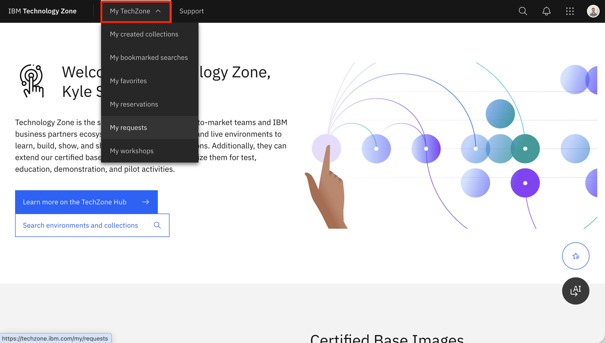
.
 
.


Now you should see the reservation we shared with you, titled something like "costco##". Select it:
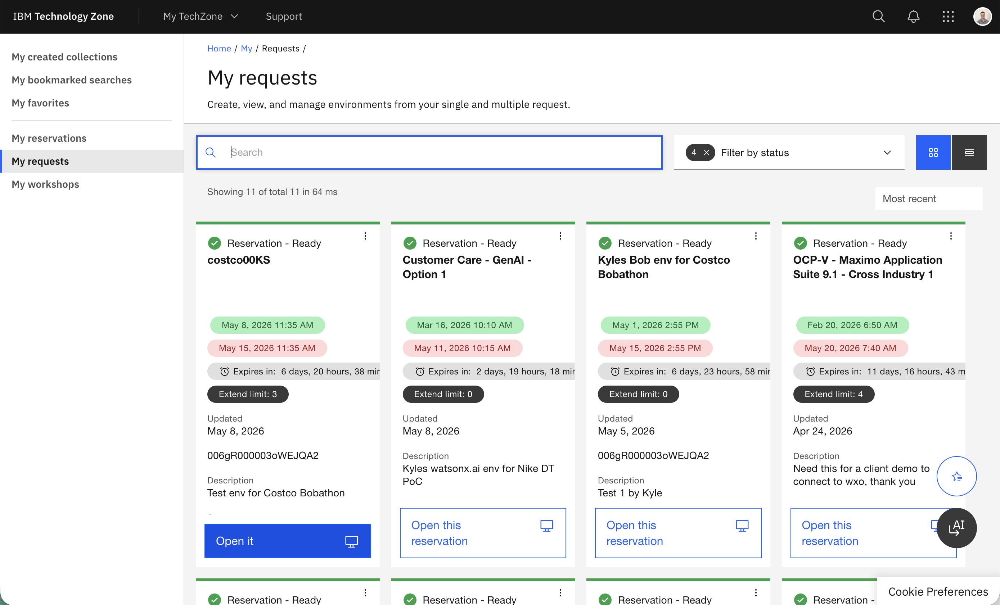
.
 
.


Now, in this reservation, select the carrot arrow button down in the bottom left to expand it like this:
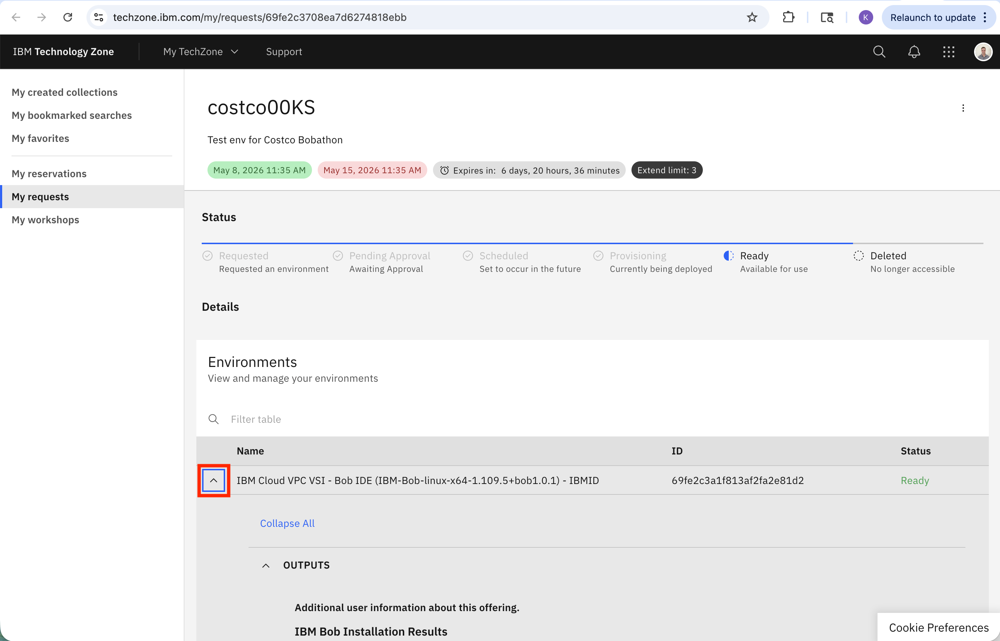
.
 
.


Scroll down until you see a Guacamole link like this example here. When you select this, it will take you to the Guacamole link:
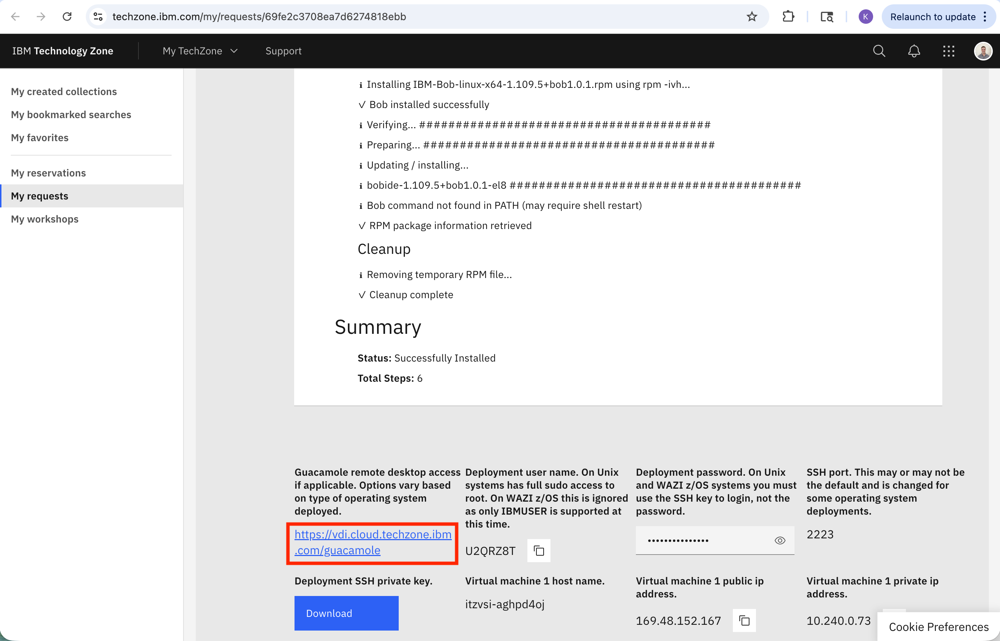
.
 
.


You should see a screen that looks like this here. If you don't see a VM screenshot appearing under the "Recent" Tab, you should expand the "+" icon in the "All Connections" to view it. Then select the black VM screenshot icon that appears in that section:
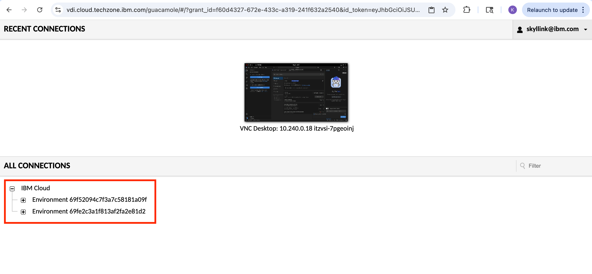
.
 
.


You should now see a VM machine that looks something like this. If you're not seeing this yet, please select the "Activities" Red Hat icon in the upper left corner:
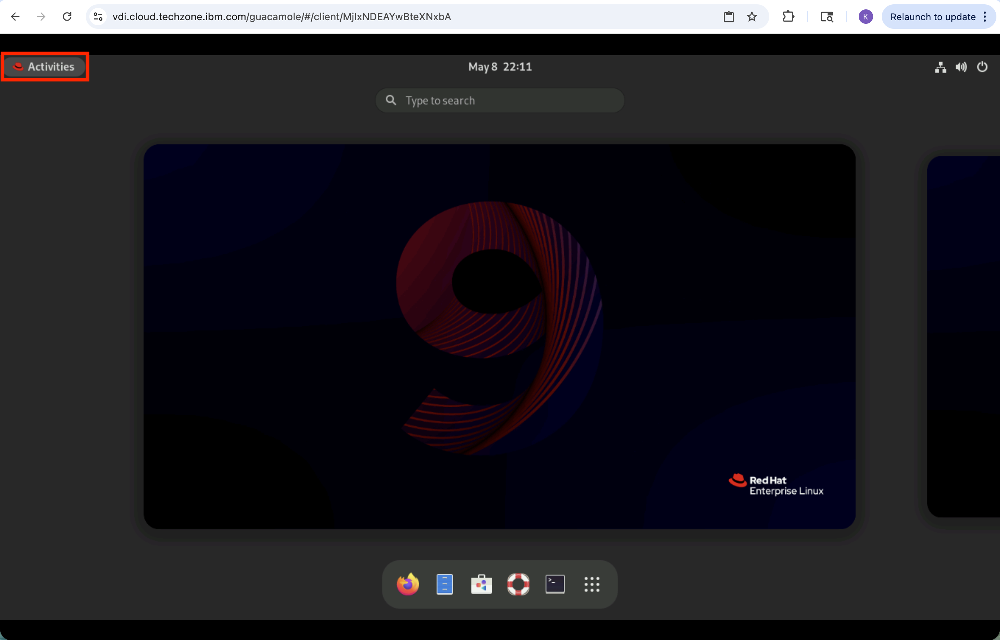
.
 
.


Now search for "IBM Bob" in the search bar in the upper middle of the VM screen. Select the IBM Bob icon like this:
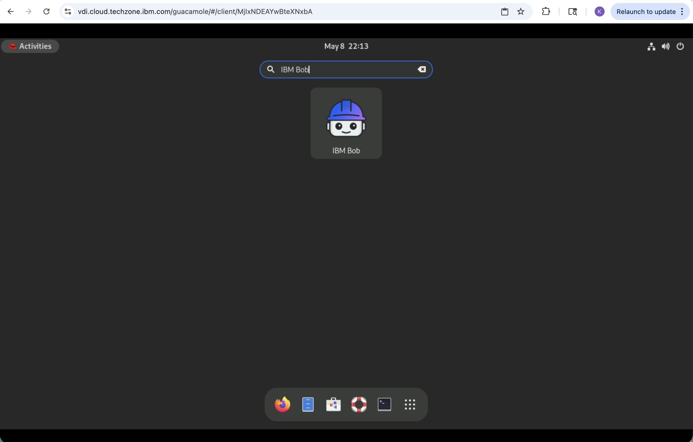
.
 
.


This process may take a few moments for the IBM Bob IDE to open up. Once it does, please skip any intro messages that come up. Please exit out of any Gnome warnings that arise and cancel any Bob upgrade prompts/messages. You should see something like this:
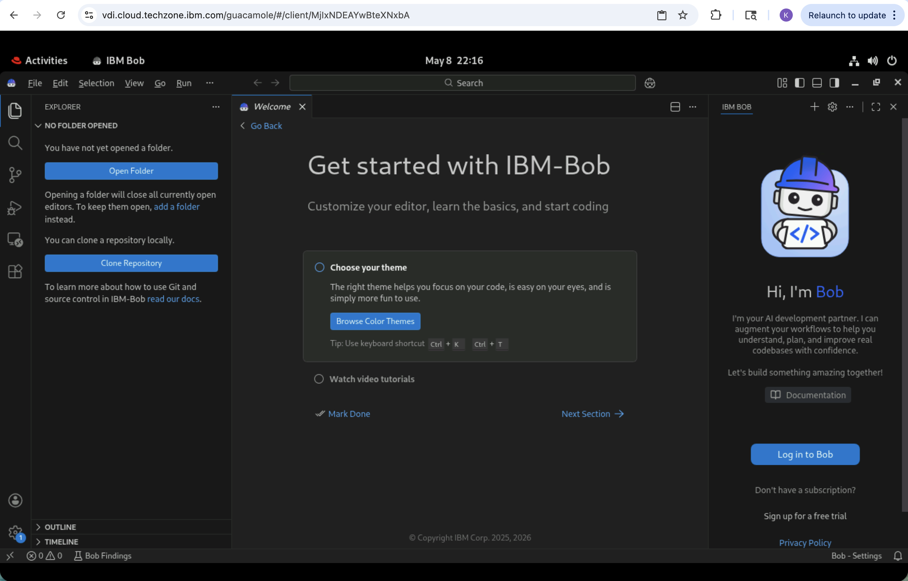
.
 
.


Then hit the blue "Log in to Bob" button in the bottom right corner, in the Bob section of the ID. When a popup appears prompting you to sign in using Bob via an extension, hit "Allow".
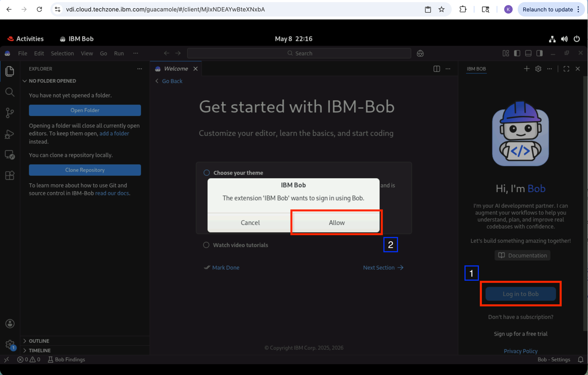
.
 
.


You'll next be prompted to let Bob open the external website. Press "Open". Then it should take you to the VM web browser. In that, please enter your IBM ID credentials.
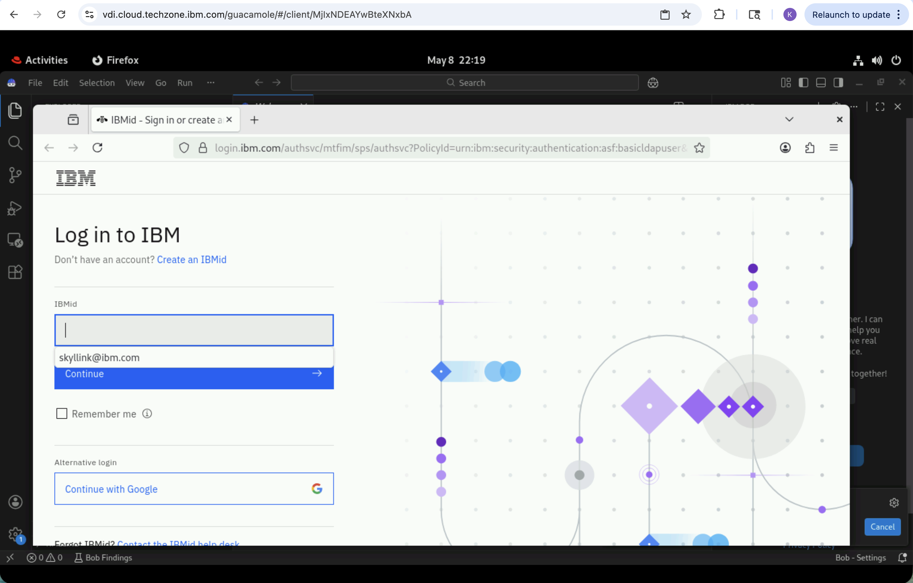
.
 
.


You should now see an "Authentication Successful" message appear in your VM browser like this here. If you see this, you can now close out of the VM web browser window.
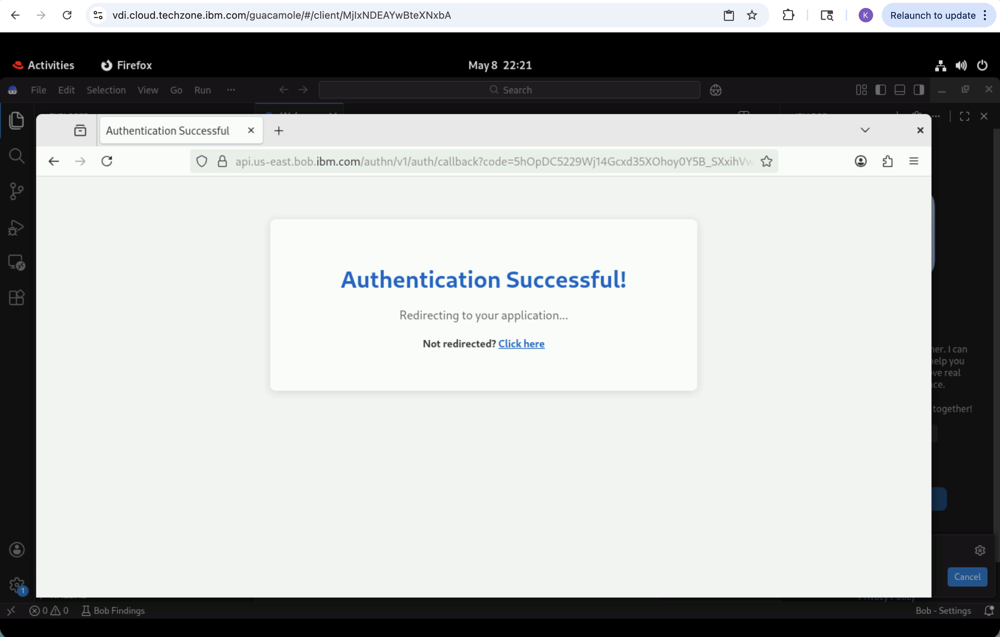
.
 
.


You will now see the Bob IDE screen, which should look like this. If this is what you see, you are now logged into our Bob Enterprise account and are ready to begin using Bob here in the interactive Bob chat window. Here, you will enter commands for Bob to execute. Simply provide plain English and Bob will get to work completing your requests.
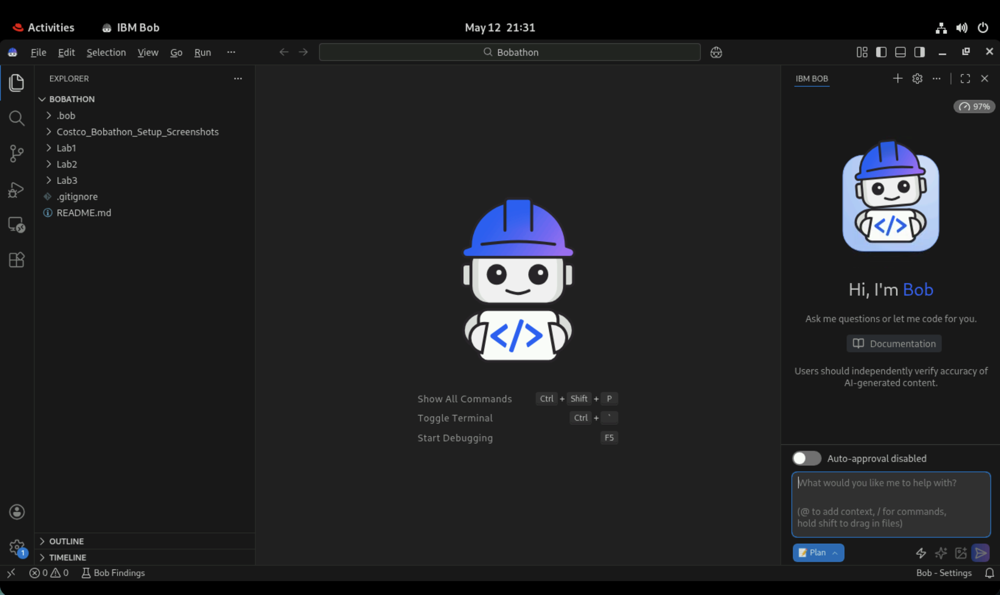
.
 
.


You are now all set to begin interacting with Bob! 


### Project Structure

You should have a folder in your workspace/VM that looks like:

```
Costco-Bob-Labs/
├── README.md                           # Main lab guide
├── PREREQUISITE.md                     # Prerequisites and initial setup
├── .gitignore                          # Git ignore rules
├── .bob/                               # Bob configuration
├── Lab1/                               # Lab 1: ACE/MQ Integration
│   ├── Bob-fundamentals.md             # Lab 1 setup instructions
│   ├── CHEATSHEET.md                   # Quick reference for Bob commands
│   ├── ace-project/                    # ACE integration project
│   │   ├── project.json                # Project metadata
│   │   ├── JavaCompute/                # Java transformation code
│   │   │   └── TransformMessage.java   # Main transformation class
│   │   └── MessageFlows/               # ACE message flows
│   │       ├── MainFlow.msgflow        # Primary message flow
│   │       └── ErrorHandling.subflow   # Error handling logic
│   └── mq-config/                      # MQ configuration files
│       ├── queue-definitions.mqsc      # Queue definitions
│       └── qm-config.yaml              # Queue manager configuration
├── Lab2/                               # Lab 2: Smart SDLC
│   ├── Java-modernization.md           # Lab 2 setup instructions
│   ├── .env.example                    # Environment variables template
│   ├── screenshots/                    # Lab 2 screenshots
│   └── snapB-java-upgrade/             # Java upgrade project
│       ├── pom.xml                     # Maven configuration
│       ├── Dockerfile                  # Docker configuration
│       ├── docker-compose.yml          # Docker Compose setup
│       ├── Makefile                    # Build automation
│       ├── README-AUTOMATION.md        # Automation guide
│       ├── QUICK-REFERENCE.md          # Quick reference
│       ├── quick-start.sh              # Quick start script
│       ├── run-liberty.sh              # Liberty server start script
│       ├── stop-liberty.sh             # Liberty server stop script
│       └── src/                        # Source code
│           ├── main/java/com/pharmacy/ # Pharmacy application
│           ├── main/liberty/config/    # Liberty configuration
│           ├── main/resources/         # Application resources
│           └── main/webapp/            # Web application files
└── Lab3/                               # Lab 3: Advanced Topics
    ├── Custom-ACE-Flow/                # Custom ACE deployment lab
    │   ├── README.md                   # ACE flow lab guide
    │   └── example_prompts.txt         # Example prompts
    └── IBM-i-Labs/                     # IBM i and RPG labs
        ├── README.md                   # IBM i labs overview
        ├── bob-rpg-ibm-i-main.zip      # RPG project archive
        ├── Lab3.0-RPG-Project-Introduction.md
        ├── Lab3.1-RPG-Documentation.md
        ├── Lab3.2-UI-Modernization.md
        └── Lab3.3-DDS-to-SQL-RLA-Refactoring.md
```

---

# LAB 1

## Overview

This hands-on lab introduces you to Bob, an AI coding assistant integrated into VS Code. You'll work with a sample ACE/MQ integration project to practice Bob's core capabilities: code navigation, analysis, modification, and documentation.

## To Start

Launch IBM Bob application by going to `Activities` and pressing on the `Bob` icon.

Open the Folder `Lab1` and begin by following the set up guide.

## Lab Guide

### [Bob fundamentals](./Lab1/Bob-fundamentals.md)
> Once finished, close out of Bob and follow the steps below to continue with Lab 2.

---

# LAB 2

## Overview

This guide covers the complete setup of the IBM Bob Smart SDLC lab environment. It is written for lab administrators as well as participants and accounts for the necessary setup and for **every issue encountered during the initial setup**.

## To Start

Launch IBM Bob application by going to `Activities` and pressing on the `Bob` icon.

Open the Folder `Lab2` and begin by following the set up guide.

## Lab Guide

### [Java modernization](./Lab2/Java-modernization.md)
> Once finished, close out of Bob and follow the steps below to continue with Lab 3.


---

# LAB 3

## Overview
In this session, there are two interactive deep dive labs. The first focuses on creating your own custom ACE deployment, and the second explores how Bob can help with IBM i and RPG.
To get started, select the folder for the lab you wish to try, and follow the READMEs to try out each lab exercise with the assistance of Bob.

## To Start

Launch IBM Bob application by going to `Activities` and pressing on the `Bob` icon.

Open the Folder `Lab3` and begin by following the set up guide.

## Lab Guide

### [Lab 3.0 RPG Project Introduction](./Lab3/IBM-i-Labs/Lab3.0-RPG-Project-Introduction.md)

### [Lab 3.1 RPG Documentation](./Lab3/IBM-i-Labs/Lab3.1-RPG-Documentation.md)

### [Lab 3.2 UI Modernization](./Lab3/IBM-i-Labs/Lab3.2-UI-Modernization.md)

### [Lab 3.3 DDS to SQL RLA Refactoring](./Lab3/IBM-i-Labs/Lab3.3-DDS-to-SQL-RLA-Refactoring.md)

